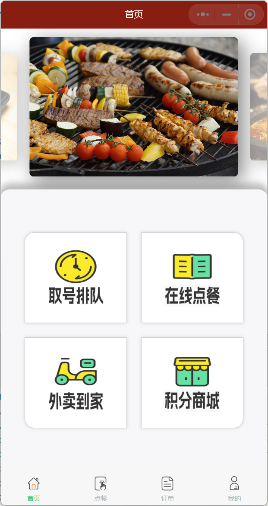
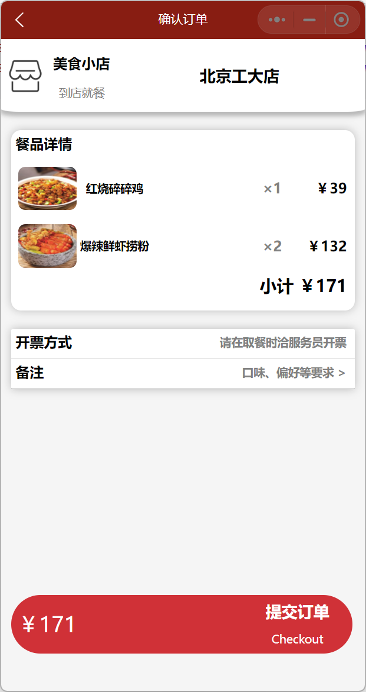
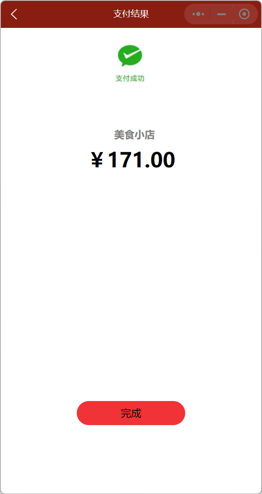
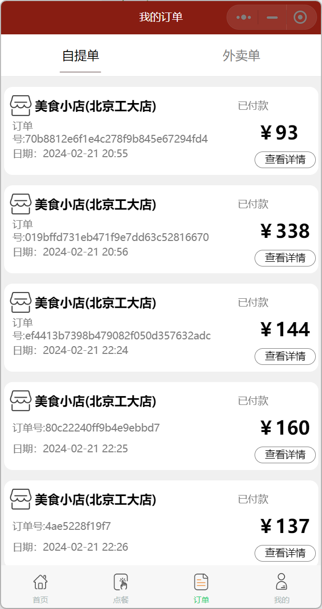
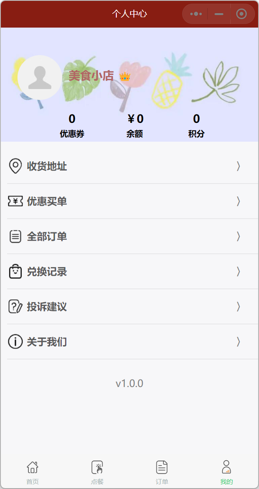

## 1. Introduction

The client WeChat Mini Program Code supports functions such as ordering food and payment. Technologies and tools used include:

- Wxss、Wxml

- JavaScript

  

## 2. Page display

<p>
	
    
    
</p>

<p>
    
    
    
</p>


## 3、Deployment steps

1. Download [WeChat Developer Tool](https://developers.weixin.qq.com/miniprogram/dev/devtools/download.html)。

2. Clone the code of this repository and modify the `appid` in the `project.config.json` file to your own appid.

   ```shell
   git clone https://github.com/dop2001/MiniOrder-User.git
   
   # project.config.json -> appid
   "appid": "Your appid"
   ```

3. Import the project into the WeChat developer tool.
4. Follow this [tutorial](https://github.com/dop2001/MiniOrder-Backend) to deploy backend code.
5. Click the compile button in the WeChat developer tool to run and preview the program.

