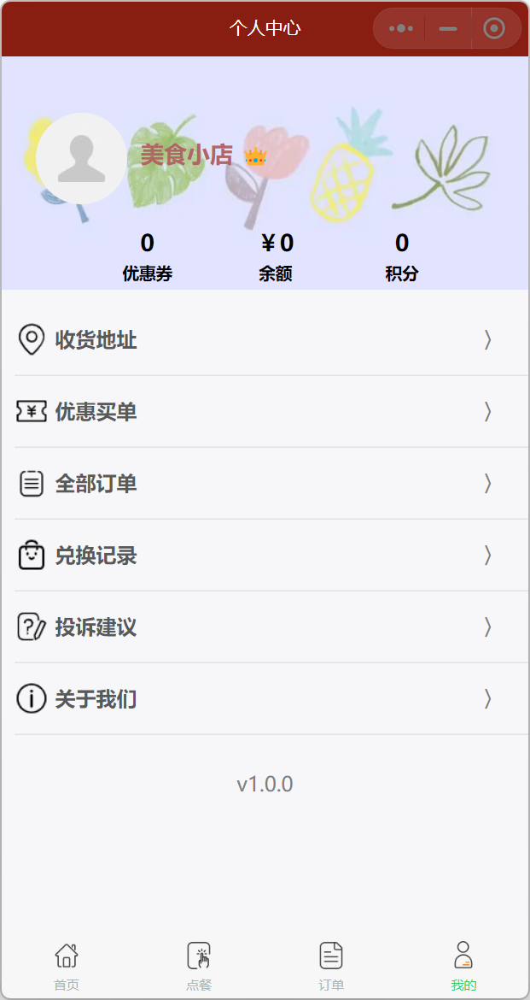

## 1、介绍

用户端微信小程序代码，支持用户点餐、支付等功能。使用到的技术和工具有：

- wxss、wxml

- JavaScript

  

## 2、界面展示

<p>
	
    
    
</p>

<p>
    
    
    
</p>


## 3、部署步骤

1. 下载[微信开发者工具](https://developers.weixin.qq.com/miniprogram/dev/devtools/download.html)。

2. 克隆本仓库代码，并修改 `project.config.json`  文件中的 `appid` 为你自己appid。

   ```shell
   git clone https://github.com/dop2001/MiniOrder-User.git
   
   # project.config.json -> appid
   "appid": "Your appid"
   ```

3. 将项目导入微信开发者工具中。
4. 按照此[教程]([dop2001/MiniOrder-Backend: Back-end service of ordering app (github.com)](https://github.com/dop2001/MiniOrder-Backend))部署后端代码。
5. 点击微信开发者工具中的编译按钮，运行并预览程序。